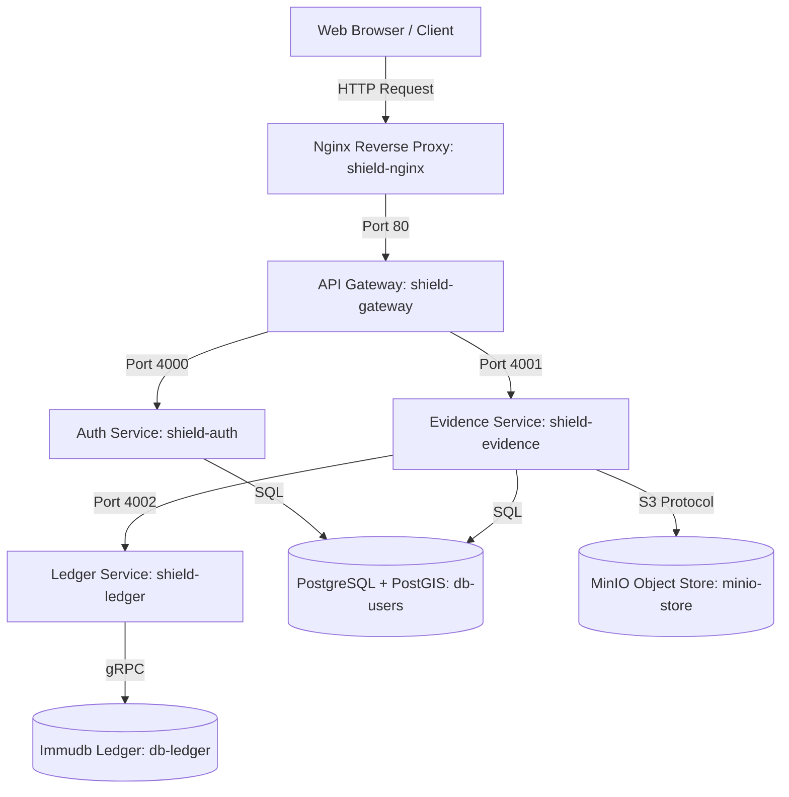

# SHIELD — Database & Storage Architecture

This document provides a comprehensive technical reference for the data persistence and storage layers of the SHIELD (Secure Hash-based Immutable Evidence Locker & Database) system. 

SHIELD implements a modern, hybrid architecture designed around the principles of **Zero Trust**, **Tamper Evidence**, and **Immutable Chain of Custody**. It separates operational, security, ledger, and raw storage concerns across three specialized engines:

---

## 1. Storage & Database Overview

| Storage Engine | Service Context | Database Name | Primary Purpose | Tech Stack / Extensions |
| :--- | :--- | :--- | :--- | :--- |
| **PostgreSQL** | `shield-auth`, `shield-evidence` | `shield_db` | Relational records, user profiles, case files (FIRs), evidence metadata, audit logs, and spatial indexing. | `PostgreSQL 15` + `PostGIS` extension |
| **Immudb** | `shield-ledger` | `defaultdb` | Append-only, cryptographically verified ledger for evidence SHA-256 hashes. | `Immudb` (gRPC / Merkle Trees) |
| **MinIO** | `shield-evidence` | Bucket: `evidence` | Off-chain raw object storage for evidence files (CCTV, images, audio, documents). | `MinIO` (S3 API Compliant) |

---

## 2. PostgreSQL Relational Schema (`shield_db`)

Both the **Authentication Service** (`shield-auth`) and the **Evidence Service** (`shield-evidence`) connect to the same PostgreSQL database instance (`db-users`) but manage separate, logical sets of tables. The `PostGIS` extension is enabled to support spatial indexing and queries.

### 2.1. Authentication & Session Management (`shield-auth`)

#### Table: `users`
Stores police department personnel profiles, authorization roles, and account statuses.
* **Primary Key**: `id` (UUID, autogenerated)
* **Constraints**: Unique `email`, Unique `employee_id`

| Column | Data Type | Constraints | Default | Description |
| :--- | :--- | :--- | :--- | :--- |
| `id` | `UUID` | `PRIMARY KEY` | `gen_random_uuid()` | Uniquely identifies the user/officer. |
| `email` | `VARCHAR(255)` | `UNIQUE`, `NOT NULL` | | Officer's email address (login username). |
| `password_hash` | `VARCHAR(255)` | `NOT NULL` | | Salted Bcrypt hash of the password. |
| `name` | `VARCHAR(255)` | `NOT NULL` | | Officer's full name. |
| `employee_id` | `VARCHAR(50)` | `UNIQUE`, `NOT NULL` | | Official police/judicial personnel ID. |
| `role` | `VARCHAR(50)` | `NOT NULL` | | System role: `Admin`, `Police Officer`, or `Judicial Authority`. |
| `designation` | `VARCHAR(100)` | | | Official rank/designation (e.g. Inspector, Sub-Inspector). |
| `station` | `VARCHAR(100)` | | | Assigned police station/division. |
| `status` | `VARCHAR(20)` | | `'active'` | Account status: `active` or `deactivated`. |
| `must_change_password`| `BOOLEAN` | | `TRUE` | Triggers a mandatory password change on first login. |
| `created_at` | `TIMESTAMPTZ` | | `NOW()` | Timestamp of registration. |

---

### 2.2. Cases & Evidence Locker (`shield-evidence`)

#### Table: `jurisdictions`
Stores geospatial boundaries of police stations or judicial administrative divisions using spatial geometry types.
* **Primary Key**: `id` (SERIAL)
* **Indexes**: Spatial index `idx_jurisdiction_boundary` using `GIST` on `boundary` for efficient geospatial containment checks.

| Column | Data Type | Constraints | Default | Description |
| :--- | :--- | :--- | :--- | :--- |
| `id` | `SERIAL` | `PRIMARY KEY` | | Auto-incrementing identifier. |
| `name` | `VARCHAR(255)` | `NOT NULL` | | Name of the police division or jurisdiction. |
| `state` | `VARCHAR(100)` | | | State/Province name. |
| `boundary` | `GEOMETRY(MultiPolygon, 4326)`| | | The geographical boundary using SRID 4326 (WGS84 coordinate system). |

#### Table: `fir` (First Information Report)
Contains primary case reports. Every evidence record must be linked to a valid FIR.
* **Primary Key**: `id` (UUID)
* **Foreign Key**: `jurisdiction_id` references `jurisdictions(id)`

| Column | Data Type | Constraints | Default | Description |
| :--- | :--- | :--- | :--- | :--- |
| `id` | `UUID` | `PRIMARY KEY` | | The case UUID. |
| `fir_number` | `VARCHAR(100)` | | `''` | Formal case file number (e.g., FIR-2026-042). |
| `case_category` | `VARCHAR(100)` | | `''` | Category of crime (e.g., Theft, Assault, Cybercrime). |
| `description` | `TEXT` | | `''` | Detailed description of the incident. |
| `location` | `VARCHAR(255)` | | `''` | Human-readable location description. |
| `jurisdiction_id`| `INT` | `REFERENCES jurisdictions(id)`| | The assigned jurisdictional boundary. |
| `reporting_officer`| `TEXT` | `NOT NULL` | | The name or ID of the registering officer. |
| `status` | `VARCHAR(50)` | | `'OPEN'` | Case lifecycle status: `OPEN`, `UNDER_INVESTIGATION`, `CLOSED`. |
| `registered_at` | `TIMESTAMPTZ` | | `NOW()` | Timestamp when the FIR was officially logged. |

#### Table: `evidence`
Stores operational record references for files uploaded to MinIO. It links the file storage to the immutable blockchain ledger by anchoring transaction details.
* **Primary Key**: `id` (UUID)
* **Foreign Key**: `fir_id` references `fir(id)`

| Column | Data Type | Constraints | Default | Description |
| :--- | :--- | :--- | :--- | :--- |
| `id` | `UUID` | `PRIMARY KEY` | | Autogenerated unique ID for the evidence. |
| `fir_id` | `UUID` | `REFERENCES fir(id)`, `NOT NULL`| | Parent FIR reference. |
| `filename` | `VARCHAR(255)` | `NOT NULL` | | Original filename as uploaded by the user. |
| `bucket_name` | `VARCHAR(100)` | `NOT NULL` | | MinIO bucket where the raw object is stored. |
| `object_key` | `VARCHAR(500)` | `NOT NULL` | | The unique storage filename key in MinIO. |
| `sha256_hash` | `VARCHAR(64)` | `NOT NULL` | | SHA-256 hash of the raw file content. |
| `category` | `VARCHAR(100)` | | `'other'` | Type of evidence: `video`, `audio`, `document`, `image`, etc. |
| `mime_type` | `VARCHAR(100)` | | | MIME Type (e.g., `image/jpeg`, `video/mp4`). |
| `file_size` | `BIGINT` | | | Size of the file in bytes. |
| `description` | `TEXT` | | | Additional context supplied during upload. |
| `uploaded_by` | `TEXT` | | | ID of the uploading officer. |
| `uploader_name` | `TEXT` | | | Cache of the officer's full name at upload time. |
| `uploader_employee_id`| `TEXT` | | | Cache of the officer's official ID. |
| `ledger_tx_id` | `TEXT` | | | Transaction ID generated by the Immudb Ledger. |
| `ledger_timestamp`| `TIMESTAMPTZ` | | | Precise timestamp when Immudb acknowledged the hash. |
| `uploaded_at` | `TIMESTAMPTZ` | | `NOW()` | Operational upload timestamp. |

---

### 2.3. Forensic & Compliance Logging (`shield-evidence`)

#### Table: `evidence_metadata`
Stores detailed, EXIF-extracted metadata of images/videos, including device markers and camera attributes.
* **Primary Key**: `id` (SERIAL)
* **Foreign Key**: `evidence_id` references `evidence(id)` (Strict `UNIQUE` constraint for 1-to-1 mapping)
* **Indexes**: Spatial index `idx_metadata_gps` using `GIST` on `gps_location` to speed up location proximity queries.

| Column | Data Type | Constraints | Default | Description |
| :--- | :--- | :--- | :--- | :--- |
| `id` | `SERIAL` | `PRIMARY KEY` | | Unique auto-incrementing ID. |
| `evidence_id` | `UUID` | `UNIQUE REFERENCES evidence(id)`| | Link to the main evidence file. |
| `gps_location` | `GEOMETRY(Point, 4326)`| | | Exact coordinates extracted from EXIF metadata (SRID 4326). |
| `camera_make` | `VARCHAR(100)` | | | Device manufacturer (e.g., Apple, Samsung, Canon). |
| `camera_model` | `VARCHAR(100)` | | | Device model (e.g., iPhone 15 Pro, Galaxy S24). |
| `original_date` | `TIMESTAMP` | | | "Wall-clock" date and time of file creation captured by camera. |
| `file_size` | `BIGINT` | | | Re-verified file size. |
| `mime_type` | `VARCHAR(100)` | | | Verified mime type. |
| `all_metadata` | `JSONB` | | `'{}'` | Complete raw JSON dump of EXIF tags for auditing. |
| `processed_at` | `TIMESTAMPTZ` | | `NOW()` | Metadata extraction execution timestamp. |

#### Table: `evidence_forensic_log`
An **append-only** log where the background forensic pipeline or system workers record compliance anomalies and tampering warning signs. 
* **Primary Key**: `id` (SERIAL)
* **Foreign Key**: `evidence_id` references `evidence(id)`
* **Forensic Flags Type**: Handled via a Postgres custom enum `forensic_flag` with options:
  - `LOCATION_MISMATCH`: The file's internal GPS coordinates do not fall inside the jurisdiction boundary of the parent FIR.
  - `TIME_SUSPICIOUS`: The EXIF creation date postdates the FIR registry date, or predates normal parameters.
  - `STORAGE_TAMPERING`: The MinIO file was edited or overwritten directly (detected by watchdog).
  - `DEVICE_INCONSISTENCY`: Inconsistent software or model headers.
  - `METADATA_STRIPPED`: All EXIF header data was deleted, indicating potential spoofing.
  - `SOCIAL_MEDIA_WIPE`: Downscaled resolutions matching popular compression algorithms.

| Column | Data Type | Constraints | Default | Description |
| :--- | :--- | :--- | :--- | :--- |
| `id` | `SERIAL` | `PRIMARY KEY` | | Unique identifier. |
| `evidence_id` | `UUID` | `REFERENCES evidence(id)`| | Link to the flagged evidence file. |
| `flags` | `forensic_flag[]` | `NOT NULL` | | Array of strongly typed forensic warnings. |
| `details` | `JSONB` | | `'{}'` | Contextual JSON (e.g., `{"distance_km": 142.5}`). |
| `actor` | `VARCHAR(100)` | | `'SYSTEM_WORKER'`| The service or daemon that triggered the flag. |
| `logged_at` | `TIMESTAMPTZ` | | `NOW()` | Timestamp when the flag was inserted. |

#### Table: `audit_log`
Registers automated and manual cryptographic verification outcomes. Every time an officer views or verifies a file, or when the `shield-watchdog` service conducts its routine integrity scan, a verification record is written here.
* **Primary Key**: `id` (SERIAL)
* **Foreign Key**: `evidence_id` references `evidence(id)`

| Column | Data Type | Constraints | Default | Description |
| :--- | :--- | :--- | :--- | :--- |
| `id` | `SERIAL` | `PRIMARY KEY` | | Unique entry ID. |
| `evidence_id` | `UUID` | `REFERENCES evidence(id)`| | Link to the audited evidence. |
| `action` | `VARCHAR(50)` | | | Audit action type (e.g. `'VERIFY'`). |
| `result` | `VARCHAR(20)` | | | Integrity scan result: `'OK'` or `'TAMPERED'`. |
| `actor_id` | `TEXT` | | | UUID of the verifying user, or `'SYSTEM_WATCHDOG'`. |
| `checked_at` | `TIMESTAMPTZ` | | `NOW()` | Timestamp of the audit check. |

#### Table: `api_audit_log`
Tracks sensitive API endpoint access across the system (specifically in the gateway and authentication services) to maintain complete regulatory compliance.

| Column | Data Type | Constraints | Default | Description |
| :--- | :--- | :--- | :--- | :--- |
| `id` | `BIGSERIAL` | `PRIMARY KEY` | | Unique entry ID. |
| `user_id` | `UUID` | | | Link to user table (if authenticated). |
| `user_name` | `TEXT` | | | Cached name of the user. |
| `user_role` | `TEXT` | | | Cached role of the user. |
| `user_employee_id`| `TEXT` | | | Cached employee ID of the user. |
| `method` | `TEXT` | | | HTTP Method (e.g., `POST`, `DELETE`). |
| `endpoint` | `TEXT` | | | Accessed endpoint URL path. |
| `ip_address` | `TEXT` | | | Client IP address. |
| `status_code` | `INTEGER` | | | Returned HTTP response status code. |
| `accessed_at` | `TIMESTAMPTZ` | | `NOW()` | Access timestamp. |

#### Table: `report_jobs`
Monitors asynchronous, high-fidelity PDF forensic report compilation tasks.
* **Primary Key**: `id` (VARCHAR)
* **Foreign Key**: `evidence_id` references `evidence(id)`

| Column | Data Type | Constraints | Default | Description |
| :--- | :--- | :--- | :--- | :--- |
| `id` | `VARCHAR(36)` | `PRIMARY KEY` | | Unique job ID. |
| `evidence_id` | `UUID` | `REFERENCES evidence(id)`| | Link to the evidence being reported. |
| `status` | `VARCHAR(20)` | | `'QUEUED'` | Task lifecycle: `QUEUED`, `PROCESSING`, `COMPLETED`, `FAILED`. |
| `download_url` | `TEXT` | | | Presigned download link to the compiled PDF document. |
| `created_at` | `TIMESTAMPTZ` | | `NOW()` | Job submission timestamp. |
| `completed_at` | `TIMESTAMPTZ` | | | Job resolution timestamp. |

---

## 3. Immudb Ledger Schema (`db-ledger`)

Immudb stores data as a cryptographically verifiable, append-only key-value store. It uses a **Merkle Tree** internal structure to generate inclusion proofs, making historical record alteration mathematically impossible.

### 3.1. Key-Value Architecture

In SHIELD, `shield-ledger` acts as the interface layer. It enforces a strict schema standard:

* **Key Format**: `evidence:{evidenceId}`
  * *Example*: `evidence:a0f7e44a-11cf-4a4b-97fa-05a90d407ff2`
* **Value Format**: `sha256_hash`
  * *Example*: `e3b0c44298fc1c149afbf4c8996fb92427ae41e4649b934ca495991b7852b855` (64-character SHA-256 hex string)

### 3.2. Cryptographic Proofs & Verification Flow

Whenever a verification occurs:
1. `shield-evidence` streams the raw file from MinIO and calculates its **live SHA-256 hash**.
2. It calls the Ledger Service (`shield-ledger`), which queries Immudb using the key `evidence:{evidenceId}`.
3. Immudb returns the **original record value** along with a cryptographic **transaction ID (TxID)** and a **Merkle Tree proof**.
4. The system validates that the **live hash** matches the **ledger hash** (representing the exact file state at the second of upload).
5. If the files match, the verification is marked `OK`. If they differ (even by a single byte), the file has been tampered with and is flagged `TAMPERED`.

---

## 4. MinIO Object Store Schema (`minio-store`)

MinIO serves as our off-chain, high-capacity object storage engine. It is strictly segmented to prevent direct web visibility or unauthorized file traversal.

### 4.1. Bucket Architecture

* **Primary Bucket**: `evidence` (configurable via `BUCKET_NAME` env variable)
* **Object Key (Path) Generation**: `{evidenceId}{extension}`
  * *Example*: `a0f7e44a-11cf-4a4b-97fa-05a90d407ff2.mp4`

By renaming the files to their unique `evidenceId` UUID, we enforce:
1. **Name Collision Prevention**: Uploads with identical filenames (e.g. `video.mp4`) are isolated and never overwrite one another.
2. **Anonymization**: Raw files in the storage bucket contain no plain-text case numbers or officer names, reducing compliance leakage risk.

### 4.2. Security Perimeter Controls

1. **Internal Client (`minioInternal`)**: Utilizes standard, isolated Docker network endpoints (`minio-store:9000`) for service-to-service file storage (`putObject` and `getObject`). The ports are never exposed to the public internet, preventing external bucket harvesting.
2. **Public Client (`minioPublic`)**: Exclusively generates high-security **presigned URLs** using temporary digital signatures. 
3. **Presigned URL Lifecycle**: When an authorized investigator requests an evidence file download:
   - The BFF Gateway authenticates their active session.
   - The Evidence Service requests a presigned URL from `minioPublic` with a strict **30-second expiration window**.
   - The user is redirected to the temporary URL.
   - Once 30 seconds elapse, the URL automatically expires and becomes inert.
